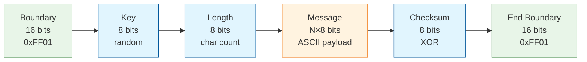
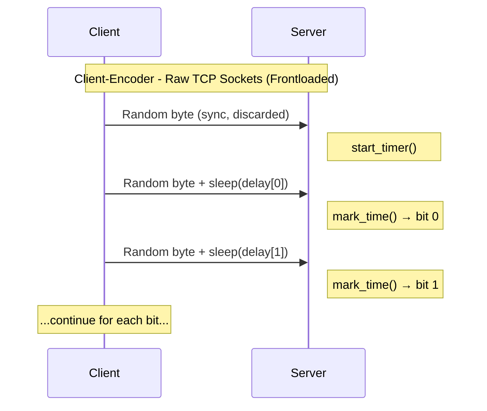
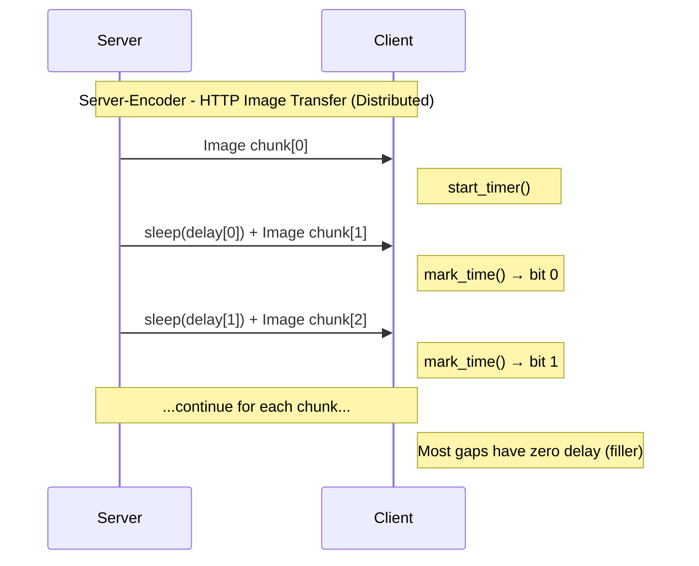

# TemporalCloak Algorithm

This document describes how TemporalCloak hides secret messages in the timing delays between data transmissions.

## Previous Work

TemporalCloak builds upon decades of research in **covert timing channels** - communication methods that hide information in the timing patterns of legitimate network traffic.

### Foundational Research
- **Lampson, B. W. (1973). A note on the confinement problem. Communications of the ACM, 16(10), 613–615.** Introduced the confinement problem and covert channels, including leakage via effects on shared system resources.
- **Kemmerer, R. A. (1983). Shared resource matrix methodology: An approach to identifying storage and timing channels. ACM Transactions on Computer Systems, 1(3), 256–277.** Presented a systematic methodology for detecting storage and timing channels throughout the software lifecycle.
- **Tsai, C. R., & Gligor, V. D. (1988). A bandwidth computation model for covert storage channels and its applications. Proceedings of the IEEE Symposium on Security and Privacy, 108–121.** Developed a model for computing bandwidth in covert storage channels, with applications to real systems. *(Alternative: Gligor, V. D. (1993). A guide to understanding covert channel analysis of trusted systems (NCSC-TG-030). National Computer Security Center.)*

### Covert Timing Channel Implementations
- **Cabuk, S., Brodley, C. E., & Shields, C. (2004). IP covert timing channels: Design and detection. Proceedings of the 11th ACM Conference on Computer and Communications Security (CCS).** Explored IP covert timing channels and proposed detection methods based on patterns in packet inter-arrival times.
- **Shah, G., Molina, A., & Blaze, M. (2006). Keyboards and covert channels. Proceedings of the 15th USENIX Security Symposium.** Introduced JitterBug mechanisms that create covert network timing channels via timing perturbations at input devices like keyboards.
- **Gianvecchio, S., & Wang, H. (2007). Detecting covert timing channels: An entropy-based approach. Proceedings of the 14th ACM Conference on Computer and Communications Security (CCS).** Proposed entropy-based detection for covert timing channels using information-theoretic measures.
- **Wendzel, S. (various). NetworkCovertChannels: Collection of network covert channel tools.** GitHub repository. https://github.com/cdpxe/NetworkCovertChannels. Aggregates practical implementations including protocol hopping (phcct, 2007), tunneling (vstt, 2006), history-based amplification (DYST, 2025; IEEE TDSC), and reconnection-based wireless channels (2021; IFIP SEC), primarily focusing on storage/hybrid mechanisms, protocol manipulation, and countermeasures.

### Key Insights from Previous Work
Covert timing channels exploit the fact that network protocols inherently include timing variations that are often ignored by security monitoring. Previous research has shown that:
- Timing channels can achieve high bandwidth in certain scenarios through multi-level encoding and parallel channels
- Detection is challenging due to natural network jitter and timing variations
- Most timing channels rely on the covert nature (observer doesn't know to look for timing steganography)
- Detection methods typically use statistical analysis, entropy measures, or machine learning approaches

TemporalCloak advances this field by implementing practical timing steganography with distributed encoding, automatic mode detection, and adaptive threshold calibration.

## Core Concept

TemporalCloak is a **covert timing channel**. The secret message is never present in the transmitted data — it is encoded entirely in the *time gaps* between successive data chunks. The actual bytes sent are irrelevant (random in Client-Encoder, image data in Server-Encoder). Only the inter-arrival timing carries information.

## Bit Encoding

Each bit of the secret message maps to a time delay:

| Bit | Delay (localhost) | Delay (internet) |
|-----|-------------------|-------------------|
| `1` | 0.00s             | 0.05s             |
| `0` | 0.10s             | 0.30s             |

The receiver classifies each observed delay using a **midpoint threshold** (default 0.05s on localhost, 0.175s over the internet). Delays at or below the threshold are read as `1`; delays above it are read as `0`.

All timing parameters are configurable via environment variables (`TC_BIT_1_DELAY`, `TC_BIT_0_DELAY`, `TC_MIDPOINT`).

## Frame Format

A complete message transmission has this bit-level layout:

```
┌──────────────┬───────────────────┬──────────┬──────────────┐
│   Boundary   │     Payload       │ Checksum │   Boundary   │
│    0xFF00    │   ASCII message   │  8-bit   │    0xFF00    │
│  (16 bits)   │   (N × 8 bits)    │   XOR    │  (16 bits)   │
└──────────────┴───────────────────┴──────────┴──────────────┘
```

**Total bits** = 16 (boundary) + N×8 (message) + 8 (checksum) + 16 (boundary) = N×8 + 40

### Boundary Marker (0xFF00)

The boundary marker is `0xFF00` — 8 ones followed by 8 zeros. It serves two purposes:

1. **Message framing**: marks the start and end of each message so the receiver knows where payload bits begin and end.
2. **Collision safety**: since messages are restricted to ASCII (all bytes < `0x80`), the byte `0xFF` can never appear in the payload, guaranteeing the boundary pattern is unambiguous.

### Checksum

An 8-bit XOR checksum is computed over the raw payload bytes and appended after the message bits. The receiver verifies this checksum after finding the closing boundary. A mismatch triggers a warning that the message may be corrupted.

## Encoding Process (Sender)

1. **Validate** the message is ASCII-only (rejects any non-ASCII characters).
2. **Convert** the message string to its bit representation using `bitstring.BitArray`.
3. **Compute** the 8-bit XOR checksum of the raw message bytes.
4. **Assemble** the frame: prepend `0xFF00`, append checksum bits, append `0xFF00`.
5. **Generate delays**: map each bit to its corresponding time delay (`BIT_1_TIME_DELAY` or `BIT_0_TIME_DELAY`).

## Decoding Process (Receiver)

1. **Start timer** on the first received chunk (this chunk carries no timing information).
2. **Mark time** on each subsequent chunk: measure the elapsed time since the previous chunk.
3. **Classify** each delay as `1` (≤ threshold) or `0` (> threshold), appending to a bit stream.
4. **Calibrate** (adaptive threshold): once 16 bits have been received, the decoder uses the first boundary marker (`0xFF00` = 8 ones then 8 zeros) as a calibration preamble. It averages the delays for the `1` group and `0` group, then sets the threshold to their midpoint. All bits are then reclassified with this calibrated threshold.
5. **Search** the accumulated bit stream for boundary markers.
6. **Extract** the payload between the opening and closing boundaries.
7. **Verify** the checksum (last 8 bits of payload) against the message bytes.
8. **Decode** the remaining bits as ASCII text.

### Confidence Tracking

For each classified bit, the decoder computes a confidence score based on how far the observed delay is from the decision threshold. Bits with confidence below 0.2 are logged as low-confidence, aiding in diagnostics.

## Encoding Modes

TemporalCloak supports two encoding modes that control how message bits are placed across chunk gaps:

### Frontloaded Mode

All message bits are packed contiguously into the first N chunk gaps. Simple and efficient, but creates a detectable pattern: early chunks have variable delays while later chunks arrive at uniform speed.

**Boundary marker**: `0xFF00`

**Frame format**: same as described above — boundary + payload + checksum + boundary, all contiguous.

### Distributed Mode

Message bits are **scattered pseudo-randomly** across all available chunk gaps, making the timing pattern much harder to distinguish from natural network jitter. Only the preamble is contiguous; the remaining bits are placed at positions selected by a PRNG seeded with a random key.

**Boundary marker**: `0xFF01` (differs in the last bit so the decoder can auto-detect the mode)

**Preamble** (32 bits, contiguous at positions 0–31):

```
┌──────────────┬──────────┬─────────────┐
│   Boundary   │   Key    │  Msg Length │
│    0xFF01    │  8-bit   │   8-bit     │
│  (16 bits)   │  random  │  (chars)    │
└──────────────┴──────────┴─────────────┘
```

**Scattered data** (placed at PRNG-selected positions after the preamble):
Message payload + checksum + **ending boundary** (all scattered randomly)

```
┌───────────────────┬──────────┬──────────────┐
│     Payload       │ Checksum │ Ending       │
│   ASCII message   │  8-bit   │ Boundary     │
│   (N × 8 bits)    │   XOR    │ (16 bits)    │
│                   │          │   0xFF01     │
└───────────────────┴──────────┴──────────────┘
```

*Note: Distributed mode includes an ending boundary marker just like frontloaded mode, even though the preamble contains the message length. This provides additional error detection and maintains frame format consistency. The length field specifies character count, while boundary markers provide the actual message framing in the bit stream.*

**Bit position selection**:

The encoder needs to decide *which* of the many chunk gaps after the preamble will carry real message bits. It does this deterministically using the random key so that the decoder can reconstruct the same positions without any extra signalling.

The image file size directly controls how many gaps are available for scattering. The image is split into fixed-size chunks (default 256 bytes), and each pair of consecutive chunks creates one gap:

```
total_gaps = ⌈image_size / chunk_size⌉ - 1
```

The receiver knows `total_gaps` before decoding begins because the server includes the standard HTTP `Content-Length` header in the response. Since the chunk size is a shared constant (`CHUNK_SIZE_TORNADO = 256`), both sides compute identical `total_gaps` values from the same formula. The `Content-Length` header is a normal part of any HTTP response, so it reveals nothing about the hidden message.

A larger image means more gaps, which means more candidate positions to scatter bits across. This has two effects:

- **Better stealth**: with more filler gaps between message bits, the timing pattern becomes sparser and harder to detect. A 100 KB image (~390 gaps) hiding a 5-char message uses only ~64 of 358 candidate positions (~18%), while a 500 KB image (~1953 gaps) uses the same 64 bits across 1921 candidates (~3%).
- **Same capacity ceiling**: the maximum message length is capped at 255 characters regardless of image size, since the length field is only 8 bits. A bigger image doesn't let you encode longer messages — it just hides them better.

If the image is too small to provide enough gaps for the message plus overhead, the encoder rejects it (validated by `DistributedEncoder.validate_image_size()`).

**Step 1 — List available positions.** Every gap index from 32 (end of preamble) to `total_gaps - 1` is a candidate. For example, an image that produces 200 chunk gaps has candidate positions `[32, 33, 34, ..., 199]` — that's 168 candidates.

**Step 2 — Shuffle with the key.** The key seeds a PRNG (`random.Random(key)`), which shuffles the candidate list into a pseudo-random order. A different key produces a completely different ordering.

**Step 3 — Take the first M.** The encoder needs M positions, where M = `msg_len × 8 + 8 (checksum) + 16 (end boundary)`. It takes the first M values from the shuffled list.

**Step 4 — Sort ascending.** The selected positions are sorted so bits are placed in order as the transmission progresses. This means the encoder and decoder can process chunks in a single forward pass.

The preamble (32 bits) is always contiguous at positions 0–31. Only the remaining message, checksum, and end-boundary bits are scattered across positions 32+.

Here's a concrete example encoding a 2-character message (`"Hi"`) into an image with 80 chunk gaps:

```
Total encoded bits: 32 preamble (contiguous) + 40 scattered = 72

M = 2×8 + 8 + 16 = 40 bits to scatter (after the preamble)
    │ │   │   │
    │ │   │   └── end boundary (0xFF01 terminator, 16 bits)
    │ │   └────── checksum (1 byte for integrity check)
    │ └────────── 8 bits per ASCII character
    └──────────── 2 characters in "Hi"

Candidates: [32, 33, 34, 35, 36, 37, ... 79]   (48 positions)

Shuffle with key=42:
  [58, 35, 71, 44, 33, 67, 39, 76, 52, 46, ...]

Take first 40, then sort:
  [33, 35, 37, 39, 41, 44, 46, 48, 50, 52, ... 76, 78]
```

The resulting gap layout looks like this:



**Layout**: Positions 0-31 are contiguous preamble, positions 32+ are scattered data at PRNG-selected locations.

**Example**: For "Hi" (2 chars) with 80 gaps:
- **Contiguous preamble**: Positions 0-31 (32 bits total)
- **Scattered data**: 40 bits (16 message + 8 checksum + 16 end boundary) at PRNG-selected positions 32-79
- **Filler gaps**: Remaining positions use zero delay (indistinguishable from '1' bits)

Because the key is only 8 bits, both encoder and decoder share a small search space (256 possible shuffles). But the key isn't meant for cryptographic secrecy — it just spreads the bits out. The security of the covert channel rests on the observer not knowing that timing steganography is being used at all.

**Filler gaps**: all gaps that don't carry a real bit use zero added delay. With the default localhost settings (where `BIT_1_DELAY` is also zero), filler is indistinguishable from a `1` bit on the wire. On internet deployments where `BIT_1_DELAY` is non-zero, filler gaps are slightly faster than real `1` bits, but both are still much shorter than `0` bits. This means an observer sees short delays scattered throughout the entire transmission rather than clustered at the start.

**Maximum message length**: capped at 255 characters (the 8-bit length field in the preamble).

### Auto-Detection

The decoder (`AutoDecoder`) collects the first 16 timing delays (the boundary marker), calibrates a threshold, and checks the last bit:

- Bit 15 = `0` → boundary is `0xFF00` → **frontloaded mode**
- Bit 15 = `1` → boundary is `0xFF01` → **distributed mode**

It then instantiates the appropriate decoder and replays the collected delays.

## Transmission Modes

### Client-Encoder: Raw TCP Sockets

The client sends **one random byte per bit**, with the delay between sends encoding the message. The server receives bytes one at a time and measures inter-arrival times. Uses frontloaded encoding.



### Server-Encoder: HTTP Chunked Image Transfer

The server sends an image file in fixed-size chunks (default 256 bytes) over HTTP. The delay between chunks encodes a hidden quote. The client fetches the image and decodes timing from chunk arrivals. Uses distributed encoding by default.



In distributed mode, most chunk gaps carry zero delay (filler). Only the preamble gaps and the PRNG-selected gaps carry real timing information. The client's `AutoDecoder` detects the mode from the boundary marker and knows which gaps to interpret.

The encoding/decoding roles are **swapped** between modes: in Client-Encoder the client encodes; in Server-Encoder the server encodes.

## Capacity

The number of characters a transmission can carry depends on the available "delay slots":

- **Client-Encoder (TCP)**: unlimited — the client can send as many bytes as needed.
- **Server-Encoder (HTTP image)**: constrained by image file size. Each chunk after the first provides one delay slot.

**Frontloaded mode** — maximum message length for an image of size `S` bytes with chunk size `C`:

```
max_chars = (⌈S/C⌉ - 1 - 40) / 8
```

where 40 accounts for the two 16-bit boundaries and the 8-bit checksum.

**Distributed mode** — same formula but with additional overhead for the key and length fields:

```
max_chars = (⌈S/C⌉ - 1 - 56) / 8
```

where 56 = two 16-bit boundaries + 8-bit checksum + 8-bit key + 8-bit length. Also hard-capped at 255 characters.

## Throughput

Throughput depends on two factors per bit: the encoding delay (`D`) and the baseline chunk transfer time (`T`). The actual time per bit is `T + D`, where:

- `T` = time to transfer one chunk (network-dependent, independent of encoding)
- `D` = added delay for encoding (`0.00s` for a `1` bit, `0.10s` for a `0` bit with defaults)

| Environment | `T` (approx) | Notes |
|-------------|--------------|-------|
| localhost   | ~0.001s      | Negligible compared to `D` |
| Production  | ~0.02s       | Hostinger VPS, varies with client distance |

With default delay values:

- **Best case** (all 1s): `T` per bit (~0.001s localhost, ~0.02s production)
- **Worst case** (all 0s): `T + 0.10s` per bit ≈ 1.25 bytes/second
- **Average** (50/50 mix): `T + ~0.05s` per bit ≈ 2.5 bytes/second

This is intentionally slow — covert channels trade bandwidth for stealth.

In distributed mode, the total transmission time is dominated by the image transfer itself, since most gaps are zero-delay filler. The message bits are spread across the full duration rather than concentrated at the start, trading slightly more total time for significantly better stealth.

## Future Work

Several advanced techniques could enhance TemporalCloak's bandwidth and robustness:

### Multi-Image Timing Differential
Instead of encoding within a single image's chunk gaps, future work could measure timing differences between corresponding chunks of two different images. This approach would:
- Encode information in the relative timing between parallel streams
- Provide higher bandwidth through cross-stream timing relationships
- Add another layer of steganographic concealment

### Advanced Modulation Techniques
- **Multi-level encoding**: Use more than two delay values (e.g., 4 or 8 delay levels) to encode multiple bits per timing event, significantly increasing bandwidth
- **Frequency domain modulation**: Encode information in the frequency spectrum of timing patterns rather than just delay durations. Instead of binary delay lengths, create timing sequences with different frequency characteristics (e.g., high-frequency rapid delays vs. low-frequency spaced delays) that can be detected through spectral analysis. This allows encoding information in both the timing and frequency domains for higher bandwidth.
- **Phase modulation**: Vary the relative timing phase between different packet streams
- **Adaptive modulation**: Dynamically adjust encoding parameters based on detected network conditions and jitter patterns
- **Error correction coding**: Add forward error correction to improve reliability over lossy network conditions

## Conclusion

TemporalCloak demonstrates a practical implementation of covert timing channel steganography, hiding secret messages entirely within the timing patterns of legitimate HTTP image transfers and TCP socket communications.

### Key Innovation
TemporalCloak is best understood as a practical, production-style example of covert timing channel steganography: one of the few publicly available, user-friendly implementations that supports dual real-world modes (client TCP and server HTTP image transfer). Its distinguishing features include:
- **Real-world deployment**: Running as a systemd service on a public VPS with TLS termination
- **Dual transmission modes**: Supporting both client-initiated (TCP sockets) and server-initiated (HTTP image transfers) covert communication
- **Automatic mode detection**: Self-identifying encoding schemes through boundary marker analysis
- **Robust error handling**: Adaptive threshold calibration and checksum validation for reliable operation over lossy networks

### Contributions to the Field
TemporalCloak advances covert timing channel research by providing a complete, deployable system that addresses practical challenges in real-world network environments. It demonstrates how timing steganography can achieve reliable communication while maintaining the covert nature that makes these channels difficult to detect.

### Applications and Limitations
Covert timing channels like TemporalCloak have applications in secure communications where traditional encryption might attract attention. However, they are inherently low-bandwidth and rely on the observer's ignorance of timing steganography for security. Future work in advanced modulation techniques could significantly improve bandwidth while maintaining stealth properties.
